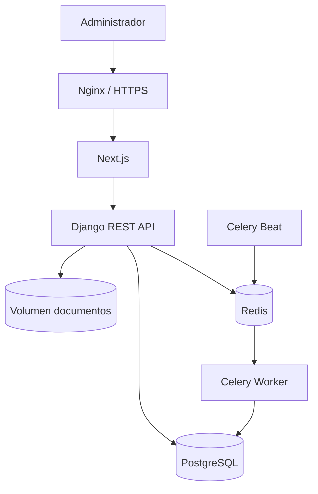

# Arquitectura

Global Billing es un monorepo con dos aplicaciones y procesos de soporte:

## Límites

- `backend/apps/*`: dominios separados; los servicios contienen las operaciones transaccionales y las vistas se mantienen delgadas.
- `frontend/app`: rutas; `components`: sistema visual y superficies; `lib/api.ts`: transporte y formato COP.
- PostgreSQL guarda metadata y montos enteros COP; los binarios viven en un volumen persistente.
- Redis es transporte de jobs, no fuente de verdad.
- Nginx termina TLS y reenvía a Next.js. Next reenvía `/api/*` al backend, permitiendo cookies first-party y CSRF.

## Decisiones

- Django 5.2 LTS y DRF 3.16 por compatibilidad estable.
- UUID en entidades principales y montos como `BigIntegerField` en pesos COP.
- Operaciones críticas con `transaction.atomic()` y bloqueos de filas.
- Registros financieros se anulan, no se borran; cierres y asignaciones usan snapshots.
- `GlobalGlass` encapsula `liquid-glass-react`; el fallback CSS mantiene contraste en Firefox/Safari y con movimiento reducido.

Los roles se amplían mediante permisos sin cambiar relaciones. Un futuro módulo contable puede consumir eventos sin introducir débito/crédito en el dominio administrativo actual.
