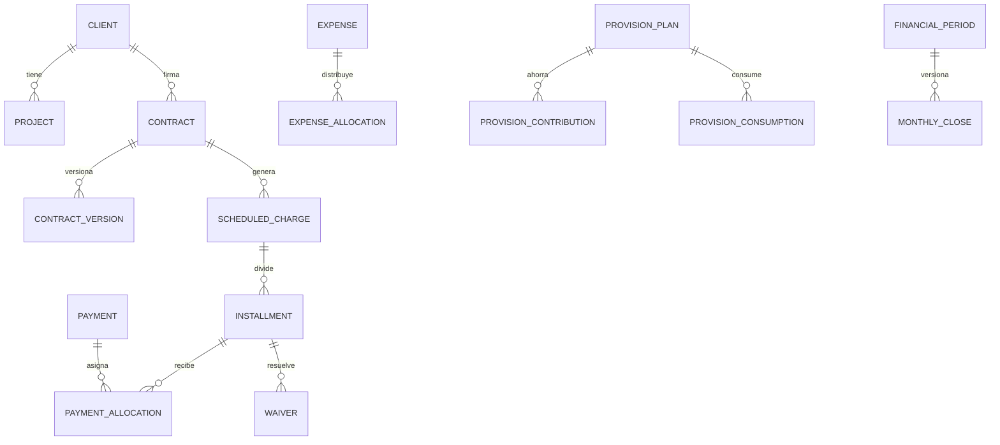

# Modelo de dominio

- Cliente es la contraparte; proyecto es la iniciativa; servicio es el catálogo; contrato contiene condiciones y vigencia.
- `ScheduledCharge` representa la obligación del periodo. Sus `Installment` son fechas de pago, por lo que 275.000 + 275.000 sigue siendo una mensualidad de 550.000.
- `Payment` es dinero real; `PaymentAllocation` indica a qué obligaciones corresponde.
- `Waiver` resuelve exigibilidad sin inventar un movimiento bancario.
- `ExpenseAllocation` guarda método y snapshot; no se recalcula silenciosamente.
- Una provisión compromete caja, pero solo el gasto real afecta resultado económico.
- Fondos internos y transferencias reclasifican caja.
- Política y cierres se versionan por fecha. Reabrir nunca elimina snapshots.
- `LegacyRecord` conserva referencia exacta del Excel y `LegacyDistributionParty` preserva etiquetas sin asumir identidad.
